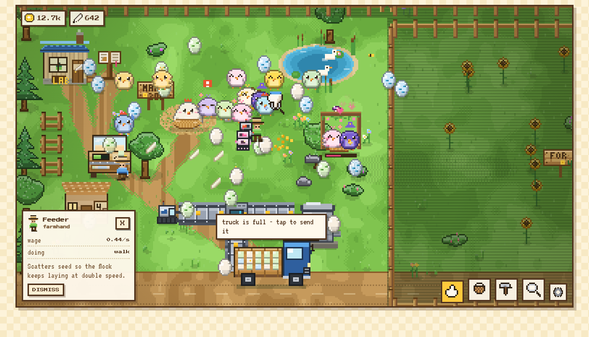

# Inf Egg Co.

A 2D pixel-art incremental game. A raccoon inherits Grandmama's farm - one old hen, a bare field and a bicycle - and, being a raccoon, decides to get super rich. He is still here: the founder walks his own farm in a top hat, tells you what he wants next in his own words, and takes the credit the moment it lands. He is drawn as a chibi: a round head thirteen rows tall and sixteen wide - wider than the body under it - with a rounded ear at each top corner, a pale blaze straight down the middle of the forehead, a bandit mask of two rounded black patches either side of it, a small eye set in each - a four-by-three white with a two-by-two pupil ringed inside it - a wide pale muzzle below with a short black nose bar, and a fat ringed tail hanging behind his right shoulder - and eleven expressions he wears without being asked: he grins when an order is signed off, goes wide-eyed at a delivery, hearts over a scratch behind the ear, coins in his eyes on a sale, narrows them when he is being smug about it, and sulks when an order runs out of time. You are the hand that runs the company he founded: farms, factories, a crew, a fleet, a gene lab, a kitchen, a chicken park, branches on a spinning globe, a time machine and eventually a seat on the stock market, across twenty plots of a 1280x832 valley and six **ages** of the company, from straw to Jurassic. Every pixel is generated procedurally in code - the two pixel fonts included - so there are no image files, no emoji and no icon fonts.

It opens on an animated dusk title screen: Mama Hen and her chicks on the hills, eggs drifting up through the sky, and a tally of how many of the 128 chickens you have found so far. Press START on a fresh save and a three-scene **intro** plays - the letter under a street lamp, the walk up to the gate with a suitcase, the raccoon in a top hat dreaming of trucks and towers - and then you **found the company** on a **certificate of incorporation**: a sheet of ruled paper with a red margin and two punched holes, the founder's photo in a box, the particulars on dotted lines (name, mark from twelve, paint and trim from twelve colours), a specimen of the roadside sign, and a line at the foot you have to **sign with the mouse or a finger** before FILE IT lights up - the stamp in the corner says UNSIGNED until you do. The sheet runs in two columns, the particulars down the left and the specimen of the sign and the ruled signature block down the right, so the whole certificate is on screen with FILE IT in reach; a narrow window stacks the two. Your scrawl is kept with the save and comes back onto the line whenever you re-file: the sign by the road, the paperwork and the market listing wear the name and colours from then on, and you can amend them any time from the menu or by tapping the sign.

Nothing is shown before it is earned. The rack starts with three tools, the desk with three keys, the palettes nearly empty; every tool, brush, crop, building, decoration and screen is a **cube in the Lab** that you install for feathers, and the founder's **47 jobs** tell you which one to go for next.



## The plant

The interface is the company's, not the farm's: **galvanised zinc plate** with a lit top edge and a dark sill, stencilled labels, screws in the nameplates and hazard tape wherever the company wants your attention. Hazard amber is the only loud colour, and the warm pixel valley inside the stage is the only warm thing on screen - the machinery is bolted around it.

Keys travel two pixels when you press them and the highlight along their top edge flips to a shadow; panels slam into place in four steps rather than easing in; a gauge at its limit blinks amber; a progress bar runs a sheen while it fills; hazard tape crawls very slowly, so the plant looks live; a locked key is crossed off with hatching but its icon stays legible, so you can see what you have not unlocked yet; and the readout **counts up** to a new figure the way a mechanical one does instead of snapping to it. Every animation steps rather than eases, so it reads pixel-cut, and all of it stops for anyone who asked for less motion.

Every word in the game is set in **Eggworks**, a pixel typeface drawn cell by cell for it and packed into a TrueType file by `tools/mkfont.py`. One drawn cell is 128 of 1024 units - ten cells to the em - so at any font-size that is a multiple of 8 every cell lands on a whole device pixel and the type has hard edges with no blur. The bold weight is the same drawings smeared one cell to the right, with a rule that never closes a one-cell counter, so bars grow with the stems they meet and the apex of `A` still lands on its right stem; `W` and `M` keep the thin skeleton, because six cells cannot hold two stems two cells wide and a spike between them, and a slightly lighter stroke beats a letter that reads as an `N`. Nothing is loaded from a font host; the face rides in the stylesheet as base64. Type across the interface runs on one scale of four sizes, all multiples of 8 so every drawn cell keeps whole pixels: 8px for badges and footnotes, 16px for labels, body copy and the small print, 24px for panel headings, all of it bold. The furniture is measured off the type rather than guessed - the bold face advances 0.875em, so a six-letter key name is 5.25 times its font-size, and a rail cap has to clear that plus its own borders or the name loses a letter off each end. Anyone who wants it larger turns on the big interface in Settings, which steps the whole scale up.

## Feel

Nothing happens quietly. There is one particle system with eighteen kinds of thing in it - dust, hot sparks that leave a trail, smoke that grows as it climbs, feathers that flutter instead of falling, straw that tumbles end over end, grain that arcs out and bounces off the ground it was spilled on, clods of dirt with a dark underside, four-point twinkles, tumbling chips, expanding shockwave rings flattened onto the ground plane, glints, ground dust thrown sideways, bubbles, columns of light, coins that flip as they fly, hearts, numbers set in the game's own type, and whole sprites that fly off and pop - plus three screen-wide effects the rest of it borrows to land a punch: a **shake** that never lets a smaller jolt soften a bigger one, a **coloured flash**, and a **held frame** that stops the world for a beat on a real impact.

Every moment in the game is wired into it. Sweeping an egg pops a ring off the shell, throws sparks in its shell colour, flies the egg itself up out of the grass, and raises the pitch of the scoop; a run of them counts up, and every fifth says so and hits harder. A golden one adds a burst of coins, a flash and a jolt. An egg inside the basket's reach leans toward the cursor and stretches, and motes stream in from the edge of the ring while you sweep. A building lands with dust out sideways, chips of timber, a thump and a held frame. A tree comes down in splinters. Harvesting throws the crop up off the tile with a number over it. A sale rings up coins, a beam and a jolt scaled to the size of the load. Hatching sheds feathers; a rainbow hatch stops the screen. A new age washes a ring across the whole valley. Tilling throws clods, sowing throws seed, a hen at the feed scatters grain, an egg laid in the nest kicks up bedding and a hatch sheds down and straw together. And the plant is never still: mills and kitchens smoke, the mill throws chaff, coops shed bedding, troughs spill feed, the cannery boils, dynamos arc, polishers glint, the gene lab hums, and rain lands in little splashes.

The ground keeps a record of it. Everything that stands on it drops a shadow with a soft fringe and its corners cut, offset a pixel the way the light in this valley falls, rather than the flat strip a building used to lay behind itself. Walk the founder about and he leaves **paw prints**, left foot and right in turn; the hens leave three-toed tracks where they scratch about. Each print is a pressed dark core with a pale lip along its top, so it reads as a dent in the soil and not a smudge the colour of it, and they fade out over several seconds. They live in their own list, drawn before anything that made them, so the founder walks over his own tracks instead of under them.

All of it obeys the particles setting, is capped so a long chain can never stutter, and is dropped entirely for anyone who asked for less motion.

## Bugs

Something lives in the soil. Install **The Spade** in the Lab and a DIG tool goes on the rack: dig anywhere you own and you turn up **worms, fat grubs, beetles, crickets and snails** - turned soil and ground near a compost heap turn up far more, and rain brings worms up all over the ranch on their own. Each species crawls its own way: the cricket hops, the snail barely moves, the beetle scuttles, the worm ripples along. Each burrows back down after half a minute, flashing while it goes so you get a moment to grab it.

A loose bug is the best feed on the farm. A hen drops whatever she is doing and **runs it down** at three times her walking speed, and it leaves her laying twice as fast for up to 26 seconds; the chicks are keenest of all and look furthest. Pick one up by hand or sweep it up with the basket and it goes in **the jar**, which rides on the readout: scatter a handful over the flock and watch them go, or sell it to the bait trade by the species or by the lot.

Two buildings farm them for you. The **Compost Heap** breeds its own and they crawl out for the hens; the **Worm Farm** is a stack of crates that fills the jar by itself, with a card on the front counting it. Both take a second storey, which halves the wait.

## The road

The valley is not just yours. Cars come thick both ways - one every three or four seconds, up to nine on the road at once - and roughly one in five **pulls over**: it slows, brakes light up, it stops on the verge, somebody gets out, walks up to your fence, says something about the place and gets back in. Along the verge and the forest trail there is other traffic entirely - a loose cow, a sheep, a pig, a goat, a line of ducks, a badger walking its dog on a dashed lead, an otter with a sheep in tow, a hare jogging, somebody strolling, a delivery droid on its rounds - all of them on the verge, since nothing walks through the wood over the road. They stop to stare over the fence and say what they think; the livestock have their own noises. Only one of them talks at a time, so the field never fills with speech clouds.

## The front of house

There is no interface furniture on the way in. The game opens on a **theatre**. Back to front: a dusk sky with searchlights raking it and the company blimp drifting over; three parallax layers of city, hills and works; a **proscenium arch** with bulbs set into the pillars, a scalloped valance and curtains tied back with tasselled sashes; a painted **backdrop flat** that slides in for each act - a forest, a half-built factory, pallets of cash, a coop wall; three coloured **spotlights** that converge on the founder and sweep on the beat, with dust hanging in the beams; a boarded stage with a hazard lip and **footlight cans** throwing pools up at him and his reflection in the varnish; and an **audience of hens** along the front, heads and shoulders over the lip, bobbing in time with the odd flashbulb going off. A **marquee** hangs over it all with bulbs chasing round the board. Everything moves to one beat clock.

On the stage the founder runs his act: a number with the red guitar on a pile of money, a tree taken down in four chops, a factory hammered up storey by storey with the company's mark on it, and a line of chickens punched into the wings with a POW. Hens wander on and can be clicked; so can the blimp. One instruction: **click anywhere** - and a handful of confetti goes up where you tapped.

A **roller shutter** comes down over the whole screen and lifts on the hatchery store room: boarded walls, a shelf of stacked egg trays, a grading chart nailed up, one work lamp, and a crate of straw with **three eggs** in it. Each egg is a save, drawn with the same egg art the game uses: the further a company has come the finer its shell tier and the more it has **cracked**, because it is closer to hatching, with the company's mark stencilled on the side and a rail of completion under it. Tap one to play it - it splits open and the shutter carries you to the farm. To delete a save you **pick the egg up and throw it away**: drag it out of the crate, a scrap bin slides in, and dropping it there asks once before the egg arcs off and smashes. A single settings key sits in the corner; there is nothing else.

The four **cutscenes** are letterboxed shots with a slate in the corner - a wet street under a lamp with the letter blowing in, the farm gate at dawn, the arithmetic on the back of an envelope, and the permits going through - and the captions type themselves one fat pixel letter at a time, each letter dropping in with a bounce, the words that matter in amber.

Founding the company is **one sheet with three things on it**: the name, in the biggest type on the page; the mark, from twelve; and the livery, picked as paint-and-trim pairs so you choose once instead of twice. Under them is the sign it will make and a line you have to **sign with the mouse or a finger** before FILE IT lights up. The registry's letterhead, the form number, the founder, the date and the captions are all gone.

## The drone, and the camera

Quest rewards used to come up the track in a limousine. They come in by air now: a **drone** in the company's paint lifts over the hill, crosses to wherever the founder is standing, hovers there with the parcel swinging on its hook, lets go, and climbs away. The parcel comes down on a **parachute** and sits on the grass until you open it.

The **first** delivery is a scene. The game takes the camera off you: it pushes in on the drone, drops letterbox bars, fades the interface out of the way, puts a chevron over the drone and asks you to **tap it**. Tap it and it releases; the camera rides the parcel down and asks you to open that. After that it is just a drone and it drops on its own. A ten second fuse on the hover and a fourteen second one on the director mean it can never leave you looking at the sky.

The camera that does this is the game's own. The world is drawn at a whole number of screen pixels to a world pixel, so **zoom is that number multiplied** - and because every piece of culling, every hit test and every screen-to-world conversion measures the viewport out of one record, keeping that record in step with the zoom makes the whole game agree about where things are without touching any of it. On top sits a small director: point at something, hold, drop the bars, put a line of instruction at the foot of the frame, hand the camera back. It also throws a **punch** - a quick shove of zoom about the centre of the screen - for the moments that want one: a building landing, a rainbow hatch, a plot of land bought, a new age.

Two other beats have the camera to themselves: the **first egg to hatch** on a farm, and the turn of an **age**.

## Cartoon

On top of the fifteen kinds of particle there are four comic ones: a **word burst** - fat letters on a jagged plate that pops past its size and settles - for KA-CHING, BUILT, GOLD, SIGNED, SOLD, RAINBOW and HUSH; a **starburst**, the ragged flash a comic puts behind a bang; **speed lines** rushing out of a point; and the **dizzy stars** that go round a head that has just been fussed over.

## Work orders

The founder no longer stands over you narrating the job list. Work comes down as **paperwork**: a numbered order (WO-014) from a department, a scope of work with tick boxes, a site, and a reward payable on completion. Three are open at once on a clipboard under the readout, and you **sign for** a finished one yourself - then the company car brings the reward. The board itself is a **filing cabinet**: five department drawers, one open at a time, each showing only the orders that have actually been issued and a line saying how many are still to come - rather than all forty-seven at once with most of them greyed out. He is still out on the farm with his own opinions; he just does not read you the objectives.

## The Warden

Fell a tree and something comes up out of the stump: a short, round, orange thing with a mustache far too big for it, who **speaks for the trees** and would like a word. He objects at length, takes a bribe in feathers if you tap him, and sulks off. He turns up in the menu's chopping act and in the fourth cutscene too, and meeting him is one of twenty secrets. Bother the founder ten times, meanwhile, and a hen climbs out of his hat.

## The overhaul

The game opens on a **main menu** now, not a title card. The founder is on a stage in his uniform running through his act while you choose a save - a dance with the red guitar in front of stacks of money, a tree to chop down, a factory hammered up plank by plank with the company mark on it, and a line of chickens to punch into the wings with a POW - each to a line of his song. Three **eggs** are the three save slots, each filled to the percentage of the game it has finished, with the company's name and colours, its age and how long it has been played on the shell. Settings, the Wardrobe and the Achievements are on the menu and on the in-game gear key. The intro has a fourth scene: the plan.

- **Quests are a board, not a chain.** Three jobs are live at once, each a to-do list of tick boxes with its own progress bars, pinned under the HUD with what the founder is saying about them. Every quest has his dialogue on the board, and a line for when it is done. Finish one and it says READY: you **claim** it yourself, and the reward arrives by **limousine** - the black car pulls into the lay-by, leaves a wrapped present in the company's colours on the grass, and you tap the box to open it. Achievements arrive the same way, with a piece of wardrobe inside.
- **Food.** Every harvest leaves a share of the crop in the **Pantry** as produce - fourteen crops now, with carrots, potatoes, tomatoes, cabbages, watermelons and rice joining the list - which you sell, or let the **Cannery** turn into flour, popcorn, jam, hot sauce, crisps, coleslaw, melon juice, rice cakes, pumpkin pie or **super feed** that keeps a hen laying double for three times as long. Chickens peck visibly when they eat, crumbs and all, and Mama Hen's supper lasts nearly twice as long and a pat costs her half as much.
- **The valley map** replaces the paper one: a living, zoomable, draggable map of the ranch, the five towns, the river and the coast, with traffic on the roads, your own vehicle driving its route with its load on a badge, the weather over every town, whatever is happening on each road (jams, roadworks, storms, fairs, parades and market days, each changing trip times or prices), and your **factories** in the towns you open, each adding to every load there and earning on its own.
- **The garage** sells the vehicles, paints them in any brand colour with a decal, fits five upgrades (engine, tyres, cargo rack, egg cooler, big horn) and lets you choose **how to drive to each town**: the tolled highway, the free lane or the scenic route that pays more.
- **The HR Office** is a building. Inside is a dark security room with a wall of live camera monitors, one on every worker, a big desk screen on whoever you pick, and their file beside it - ratings you can **train** a point at a time, a post to move them to, a button to let them go. Posters go up from here; the applicants they bring walk in off the road as before.
- **The HUD** is one bar - coins, feathers, feed, chickens, pantry, sky and age - over the to-do list; numbers pop when they change. Every tool on the rack has a bigger, clearer icon; every progress bar in the world is the same bar. News pop-ups are off by default and the rainbow is gone; the founder and the to-do list carry the news. The Lab's screen is drawn at three pixels a pixel so the board reads clearly.
- **The valley has a day**: dawn, noon, dusk and a lamp-lit night with fireflies, leaves blowing off the trees, dust off every walking heel, soft dithered shadows under everyone, smoke off the Cannery.
- **Thirty achievements** each unlock a piece of the founder's **wardrobe** - hats, suits (the tycoon green with sparkle shades and the red guitar among them), glasses and something for his paw - worn on the farm, on the menu and in every portrait.
- **Settings**: sound and volume, news pop-ups, screen pop, day and night, particles, a big interface, a frame counter, autosave.

## How it plays

The land starts **bare** - sun-bleached scrub and nothing else. No pond, no paths, not a stone scattered for you. Every tree, path, terrace and pond on your ranch is one you painted there yourself. **Mama Hen is a big broody hen settled low over her nest - serrated comb, wattles, an arched neck and a folded wing - and she works for her supper**: a full belly keeps her laying for a couple of minutes, and once it runs out she stops, sits there and waits for you to scatter feed by her nest. Petting her costs a little of that supper too. You pedal the first eggs to the village on a **bicycle** that carries four. The money buys seed; the seed becomes feed; the feed grows chicks into hens; the hens lay; the eggs buy a cart, then a van, then routes to bigger towns that pay more. Everything else grows out of that loop.

You are the hand. Everything on the field is touchable:

- **Hand** - tap chickens (and Mama Hen, if she has been fed) to pet them for an instant egg; hold and drag to pick chickens up and carry them; grab single eggs; drag empty grass to pan the camera.
- **Basket** - hold and sweep to magnet eggs into your basket (it has a real capacity). Release over the truck or an incubator to unload.
- **Feed** *(unlock: Feed Bag, 2 feathers)* - scatter pellets from the barn; chicks eat to grow up, grown hens eat to fill their bellies and lay twice as fast. A chick needs **twelve feeds and five minutes** before it is a laying bird - neither one on its own will do it, and a coop halves the wait.
- **Farm** *(unlock: The Hoe, 3 feathers)* - the landscaping tool, in four tabs. GROUND shapes the land with a **paint brush**, PLANT sows crops, TEND waters and harvests, DECOR plants things purely because they look nice. Five brush sizes, and a round brush outline sits under your finger showing exactly what it will cover. The Hoe gives you Till and clover; the Watering Can, the Sickle, the Path brush, wheat, the garden centre and the rest are their own cubes.
- **Build** *(unlock: Toolbox, 6 feathers)* - incubators, love nests, staff huts, silos, vacuums, blowers, sorters, conveyors and fences. Drag to paint belt lines. Nothing appears by magic: placing a building stakes out a **site**, and the movers come.
- **Inspect** - tap any hen, worker, machine, customer or patch of grass to read its live stats. Empty grass gives you the whole ranch report: eggs per minute, coins per minute, wages, capacity, silo stock, orders filled, honey, species found. On a building it also carries the **ADD A FLOOR** button once you have researched Second Storey.

Locked tools stay on the rack behind a padlock and say which cube opens them; locked palette shelves show a quiet "N MORE IN THE LAB" tag instead of a wall of greyed-out buttons.

Menus are places, not panels:

- The **truck** on the road sells eggs - load it, tap it, and it drives to market and returns with coins.
- **Incubators are the only way to hatch.** The egg inside rocks harder and harder as hairline cracks spread across the shell, then it splits: the two halves tumble away, a sparkle ring pops, and a chick squashes and stretches its way up out of the wreck, trailing feathers.
- **Feathers are physical** - they flutter out of every hatch and sometimes when you scoop. Sweep them up; they are your research currency.
- The **Lab shack** (or the LAB key on the desk bar) puts you at a desk. There is a keyboard, a mug, sticky notes, and an old beige monitor that boots EGGOS and runs SKILLMAP.EXE: research as a **board of little cubes** laid out in **eleven lanes**, one per module - QUESTS, TOOLS, FARM, HENS, HATCH, GATHER, MARKET, CREW, FACTORY, LOVE, DECOR - with the kernel at the top left and a trunk running down the left edge into every lane. Depth runs left to right, so each lane reads like a road: install the first cube and the next ones light up along it. There are 100 packages: 55 are **unlocks** (a padlock in the corner - a tool, a brush, a crop, a building, a screen) and 44 are **stats** that stack (a row of pips along the foot). Every cube wears its lane's colour; state is carried by brightness, with affordable cubes lit and ringed in pulsing gold and unaffordable ones sitting dark. Lane names sit in a gutter that stays put while the board pans; the taskbar chips pan you straight to a lane. Dotted stubs and question marks show where a lane goes on. Gold cubes install with one click on the README window's button.
- The **QUESTS lane** along the top is a chain of 28 goals that zigzags two rows deep: sweep five eggs, make a sale, install the Feed Bag, feed Grandma, hatch a chick, unlock the Hoe, till six tiles, sow and water, harvest, raise a hen, the Toolbox, break ground, open the depot, fill a roadside order, hire a hand, eight species, a belt line, an edit in the gene lab, a second storey, five regulars, three plots, twenty hens, twenty-five harvests, ten thousand coins, going public, a country abroad, ten branches, and the Moon. Each pays out coins or feathers the moment you get there, by itself. A bouncing arrow marks the current quest and the cube it wants you to install, with the path to it drawn in white, and a **quest card** pinned under the HUD carries the same goal, its progress bar and a hint about where to go - tap it and the Lab opens on that cube. Drop a chicken on the Lab to graduate it for bonus feathers.
- **The Index bookstand** opens an actual book - cream pages, a leather spine, coloured bookmark tabs down the edge, a dog-eared corner, and a page flip when you change tab. Seven tabs: every chicken you have found (the rest still silhouettes), your **Crew**, your **Crops**, your **Routes**, what each egg tier is worth, the **Diary** that writes itself, and the **Secrets** page - eighteen things the ranch never tells you to do, each a question mark until you stumble on it.
- **Love Nests breed chickens**: carry two in, wait for the hearts, and get a fancier egg. Two Divine parents can lay a rainbow egg, which hatches the 12 breed-only Secret species. Above those sit two tiers no nest can reach: ten **Prehistoric** birds that only the Time Machine brings back, and six **Celestial** ones that hatch from Moon eggs (128 species total in the Chickenpedia bookstand). Every hen also earns a **rank** - Rookie, Layer, Veteran, Elite, Champion - for the eggs she has laid, shown as stars over her head.
- **Buy land from FOR SALE signs** - twenty plots across a 1280x832 valley, each with its own scenery (sunflower field, lavender meadow, mushroom glen, berry grove, rocky pines, orchard, wet reeds, wildflower meadow, pinewood, thicket, prairie, birchwood, highland), and each raising chicken capacity and giving room for a bigger factory.
- Mama's signpost upgrades her egg rarity through eight tiers; laid eggs can also mutate a tier up.

### The founder

The raccoon who inherited the place is on the farm, not in a menu. He walks the owned land the way the crew do, in a top hat with the company colour on the band, and he heads for whatever the current job is about: the nest, the Lab, the bike, the incubator, the road, a field. When he gets there he says his piece in a **pixel speech cloud** - one of forty-seven lines written for the forty-seven jobs, plus something for each place he stops at and a pocketful of idle muttering. Pay a job out and he cheers, says so, and sets off for the next one.

Every hint the game used to float over the field is now something he says out loud, so the interface has one voice instead of a cloud of tooltips. There are seventy-odd lines in him: twenty-five for standing about, fourteen for a job well paid, four for each place he stops at, and a handful each for the rain, the small hours, being rich and being broke - so he comments on the weather, the clock and the state of the ledger as well as the view. His **dialogue panel** sits under the resource bar: his photograph framed in the corner, his line in quotes beside it, then a strip across the foot with the job's name, what it pays and a rail showing how far along you are. Tap the panel and the Lab opens on that job; tap the raccoon himself and he says it again, or cheers if you keep bothering him.

### Landscaping

The ranch is a sandbox, and the GROUND tab is a **paint brush**, not a block placer - the plough included. Pick a brush size, hold, and drag: the ground follows your hand in one continuous stroke, with no gaps however fast you sweep, and one sweep of TILL turns a whole field over. Terrain is stored on an 8-pixel grid, half the size of a tile, and drawn per pixel through a weighted vote of each point's neighbours - so a stroke comes out with a soft, dithered, organic edge instead of a staircase. Ponds get an undulating shore, terraces grow an earth cliff only where they are actually exposed, and Level is just another brush that rubs the paint back off.

| Tool | What it does |
| --- | --- |

| Tool | What it does |
| --- | --- |
| Till | Ploughs grass into soil you can plant in. A brush like the rest. |
| Path | Packed dirt. The crew walk a quarter faster on it. |
| Stone Path | Flagstones. Faster still, and very tidy. Research Paving Stones. |
| Raise | Banks the ground up into a grassy terrace with an earth cliff. Research Terracing. |
| Dig Pond | Scoops out water with an undulating shore. Nothing walks through it. Research Pond Digging. |
| Level | Rubs the paint back off, down to plain grass. |

The DECOR tab is a garden centre: oaks, pines, apple trees, bushes, rocks, stumps, flowers, grass tufts, clover, mushrooms, reeds, lavender, sunflowers, daisies, poppies, dandelions, an ivy patch, moss, ferns, bamboo, tulips, a rose bush and a potted cactus - 31 decorations in all, each a few coins and each generated with its own silhouette. Lift anything again with CLEAR and get half your money back. Landscaping is deliberately far more permissive than building - anywhere you own, off the road, that is not already spoken for.

### Farming and growing up

Nothing lays until it has eaten. Every hatchling is a **chick**: it does not lay, and it follows the smell of feed until it has grown. Growing up takes **both** - twelve feeds and five minutes of being a chick, whichever finishes last. Tip the whole barn over a hatchling and it is still a chick; leave one unfed for an hour and it is still a chick. Two little rails over its head show where it stands: amber for how well it has been fed, green for how long it has been growing. Research on **Hearty Feed** brings both down, and a coop halves the wait. Grown hens keep a belly that empties over a couple of minutes; an empty belly halves their laying until they eat again, and a hungry hen holds up a little seed bubble to tell you.

Feed comes from the ground, and farming is slow, deliberate work. Till a tile (the Hoe), plant a seed packet, **water it** (the Watering Can - **nothing grows dry**, not one leaf; a watering lasts a minute, and a dry crop holds up a blinking blue droplet until you come back), and harvest when it sparkles (the Sickle). With the farm tool out every growing crop shows a little growth bar; the inspect tool says how long it has left, or that it is DRY and not growing. **Harvests do not hand seeds back** - the next packet is bought - so a field is an investment. Each harvest tips a pile of pellets into the **Feed Barn**; overflow spills on the grass where the flock finds it. The quest chain walks you through all of it: till, sow and water, first harvest.

| Crop | Grows in (watered) | Feed | Notes |
| --- | --- | --- | --- |
| Clover | 90s | 4 | Comes with the Hoe. Cheap ground cover, chicks nibble it up. |
| Wheat | 150s | 8 | Research Wheat Seed. Slow and dependable. |
| Corn | 280s | 18 | Research Corn Seed. Tall, slow and generous. |
| Sunflower | 420s | 34 | Research Sunflower Seed. The richest feed. |
| Berry Bush | 240s | 12 | Research Berry Bushes. Regrows after every picking. |
| Strawberry | 200s | 14 | Research Strawberry Seed. Sweet, and it fruits again. |
| Chili | 260s | 22 | Research Chili Seed. A heavy, fiery harvest. |
| Pumpkin | 600s | 60 | Research Pumpkin Seed. Slow as anything, and worth the wait. |

**It rains.** Every four minutes or so a shower rolls over the valley - a cool wash over everything, streaks slanting down, splashes on the ground - and every crop on the ranch drinks for as long as it lasts; a rainbow hangs in the top corner for a few seconds after. A **Well** or **Sprinkler** keeps a circle permanently watered between showers. A **Beehive** (DECOR lane, Beekeeping) pollinates every crop within its circle so it grows 30% faster, and drips a jar of honey you sell for coins every minute or so. **Feed Troughs** hold a dozen pellets the flock helps itself to, and Feeders on the crew keep them topped up; a **Coop** adds room and grows nearby chicks twice as fast; a **Mill** adds a quarter to every harvest on the ranch. Farmhands harvest ripe crops whenever the grass is clear of eggs.

### The road, and the other side of it

The road is a proper road now: three tile rows of packed dirt, kerbed both sides, with a dashed line down the middle and two lanes of traffic - east on the near side, west on the far one - worn into ruts, patched, and drained at the kerb. The **far side is forest**: a dirt trail worn along the verge, then four ranks of pine and broadleaf going back into the dark, each rank standing higher up the band under a heavier wash of shade, with a mass of canopy behind them so the gaps between the trunks read as more wood rather than bare floor. Brush, ferns, toadstools, stumps, rocks and moss fill the understorey, leaf litter and fallen twigs scatter across the trail, and fireflies drift between the trunks at runtime. The sky over the valley carries **wild birds**: thirty-odd fliers crossing it in three-frame silhouettes, a third of them leading a loose V of two to five behind them, and thirty perchers sat on the fences and the grass, hopping and looking about until one moves on and drops in somewhere else. Own anything on the road row and the camera lets you look across at it.

### Billboards

Research **Billboards** (MARKET lane, next to The Ledger) and a hoarding joins the EMPIRE shelf: two legs, a braced frame, a poster and a hood of lamps. Every board on the ranch pulls the road in - customers arrive faster, pay more, and a second board opens a third space in the lay-by. Tap one and the **poster desk** opens: the board is twenty-eight by fourteen fat pixels, and you paint it. Twelve colours, three brush sizes, the bare board to rub out with, and five printed designs to start from - FRESH EGGS, BIG SALE, OUR HENS, THE COMPANY (which wears your own mark and the name you filed) and a blank board. A poster you painted yourself counts half again as much as a printed one; the road can tell.

### The traffic

The road along the foot of the valley is alive. **Traffic goes by** all day - sedans, hatchbacks, pickups, vans and the odd bus in a dozen paint jobs, two lanes, nobody driving through the car in front. Once you research **Roadside Orders** (MARKET lane, right after Logistics), **customers pull into the gravel lay-by** beside the depot sign: a car draws up and a **docket** opens over it: rows of six egg outlines - how many, and in the colour of the tier they want or better - the price under them, and a clock along the bottom that runs down over two and a half minutes. Sweep eggs into the basket and let go over the car, or carry one egg over with the hand; every egg that fits fills an outline. Fill the order and they pay two and a half times the going rate plus a feather tip and drive off; dawdle and they drive off without paying. Two cars fit in the lay-by - three once you have a couple of billboards up - and the founder shouts across the field when one is about to give up. Once you have filled a couple, the odd **VIP** turns up in a long black limousine with a flag on the bonnet - a gold-rimmed bubble with a star over it, three eggs more than anyone else wants, double the money and a triple tip, and a good deal less patience.

### The movers

Buildings are not placed, they are **built**. Put one down with the BUILD tool and the site is staked out - red stakes, white rope, churned dirt, a pile of timber - while a white box van with MOVERS down the side drives in along the road and parks as near as it can. Two movers in hi-vis climb out, walk over, and hammer; sparks fly, the frame rises plank by plank, a progress plank over the site fills, and the building pops in with a puff. The cheapest things take six seconds or so; a Grand Hatchery keeps them busy for half a minute. Two sites at once and they split up; a new job called while they are pulling away and they turn straight round. Belts and fences still go down instantly. Cancel a site and the coins come back.

### Second storeys and furniture

Research **Second Storey** (TOOLS lane) and most buildings take an extra floor: LOOK at one, press ADD A FLOOR, and the movers come back to build it - a lighter upper storey with lit windows and its own little roof. A second floor gives the building **half again its effect**: an incubator holds nine and hatches faster, a coop houses nine, a barn stores more, a staff hut has more bunks, a love nest breeds quicker, a well or sprinkler waters a wider circle, a beehive drips more honey, a Logistics HQ trims trips by 15% instead of 10%.

The DECOR shelf is gated by lane too - the **Garden Centre** (flowers, tufts, clover, bushes, rocks, daisies, poppies, dandelions, an ivy patch, moss), the **Tree Nursery** (oaks, pines, stumps, mushrooms, reeds, ferns, bamboo), the **Orchard** (apple trees, lavender, sunflowers, tulips, a rose bush, a potted cactus) and **Furniture**: a bench, a lamp post, a barrel, a birdbath with the odd robin on it, a scarecrow, a mailbox with its flag up, hay bales round and square, and a planter box in bloom.

### The Gene Lab

Every hen carries **five genes**, nought to three points each, rolled when it hatches: LAY (lays faster), SIZE (its eggs come out a tier up more often), LUCK (more golden eggs), PLUME (it sheds the odd feather for you to sweep up) and HARDY (its belly stays full longer). The inspect panel shows them as pip rows and works out what the bird is **worth a minute**. Research the **Gene Lab** (HENS lane) and build it - a white-tiled lab with a glass dome and a helix winding down its door - and the GENES key wakes up on the desk. Inside, the flock is listed best earner first with a crown on the top bird, and the one on the bench can be edited three ways:

| Operation | What it does | Costs |
| --- | --- | --- |
| Splice | Pick a donor from the list. Every gene keeps the better of the two; the donor is gone. | 40 feathers |
| Clone | A second bird, genes and marks and all, walks out of the lab. | coins scaled to the egg's value, plus 30 feathers |
| Cross | Cross the hen with a **cow** (SIZE, black patches), a **rabbit** (LAY, long ears), a **peacock** (PLUME, a teal tail fan), a **bee** (LUCK, stripes) or a **goat** (HARDY, little horns). One gene up, one mark drawn on the plumage. | 80 feathers each |

### The world, and the Moon

The valley is only the start. Research the **World Map** (MARKET lane, past the Second Lorry) and a WORLD key wakes on the desk: a room with a **globe** in it, an actual sphere of pixels turning slowly in space - every country a continent grown round its heart with a frayed noise coastline, ice on the poles, shallows along the shores, a terminator of night creeping round the back, and the Moon riding its orbit round the whole thing, passing in front and behind. Drag the globe to spin it; tap a flag on a pole or the arrows in the ledger and it swings round to face that country. Nine countries open in order down the road for coins - Featherland, Yolkshire, Shellvador, Eggypt, Cluckistan, Peckoslovakia, Coop Island, Henmark - each taking a number of **branches** that earn coins a minute on their own while you farm, and each dearer and richer than the last. **Air Freight** adds half again to every branch. The **Moon** is the last of them: eight million coins and the Moonshot cube, then a rocket leaves the valley and a dome goes up in a crater. No air, no foxes, eggs float; ten branches at six thousand a minute each, and with the **Moon Eggs** cube a branch up there posts a Celestial egg down to the Lab every five minutes. The ledger counts it all under branches abroad.

### The ages

The company lives through **six ages**, and the pill in the corner says which: **Straw** (one hen, one field, one bicycle), **Iron** (five hatched, six hundred coins earned, two things built), **Steam** (fourteen species, fifteen thousand coins, a hire, eight buildings), **Electric** (thirty species, a quarter million coins, ten orders, eight belts), **Space** (fifty species, five million coins, a branch abroad) and **Jurassic** (seventy species, sixty million coins, the Moon). Tap the pill and the Lab opens on the next age with what it still needs; the ages run along the top of the board as their own lane of stamps. Each new age puts a wash of its colour over the valley, a banner across the sky, adds eight percent to everything the company earns (the stock market excepted) and **opens a lane of the tree**: the KITCHEN lane needs the Iron Age, the PARK lane the Steam Age and the JURASSIC lane the Jurassic Age. Every lane is on the board from the first minute - the ones that are not yet yours sit dark behind a padlock with the age they need stamped on them, so you can always see the whole tree.

### The kitchen

Research the **Kitchen** (Iron Age) and a two-by-two building with a chimney and a hatch joins the EMPIRE shelf. Eggs go into its larder - drop them there, empty the basket over it, or point a belt at it - and it cooks whatever is on the board: an **Omelette** (three eggs), a **Scotch Egg** (an egg and three pellets of feed), an **Egg Cake** (six of each), each worth many times its eggs. Finished dishes stack on the counter and **diners** walk up the road to buy them, more of them once you have the Diner cube; the **Food Truck** takes the counter to town with the lorry. Research **Roast Hen** and a grown hen dropped on the kitchen goes in the pot for forty times her egg's value, more for a high rank; **Dino Drumstick** does the same for a dinosaur at eighty. Moon birds will not go in the oven. Cook every recipe and a secret pays out.

### The chicken park

Research the **Park** (Steam Age): a three-by-three enclosure with a ticket gate and a lawn. Drop grown hens on it and they go on show, up to four (six with a second floor). Appeal is the sum of the exhibits - rarer tiers, higher ranks and gene-lab marks all count, dinosaurs count fourfold - and it sets the ticket price. Every half minute or so a **tour bus** rolls up the road and lets off a crowd who walk to the gate, pay, gawp for a bit and wander home. Tickets, Gift Shop and Night Show raise the price; Bus Stop and Crowds bring more people; the **Dino Pen** lets a dinosaur into the park at all. Tap the park to see who is on show and let anyone out.

### Fossils and the time machine

Digging turns up **fossils**: every stroke of the watering can on fresh soil has a small chance of throwing one out of the dirt, three times as often with Fossil Hunting, and Amber finds them under harvested crops too. Tap one to pocket it. The **Time Machine** (JURASSIC lane, a quarter of a million coins) takes three fossils and four minutes and hatches one of the ten Prehistoric birds - Cluckosaurus Rex, Velocirooster, Tricerachick, Stegocluck, Pteracluck and the rest - drawn as an eighteen-row silhouette with a tail, crest, sail, plates or spikes as the species demands. Their eggs are cracked and flecked with amber, and worth three million coins each. De-extinction shortens the wait, Big Eggs makes them lay more.

### Secrets

Eighteen **secrets** hide in the ranch, each paying out once, the moment it happens: a hundred eggs on the grass at once, three golden eggs in a single sweep, tapping the movers' van while they work, catching a butterfly on the wing, filling the ranch to capacity, sitting through five showers, naming the company after the Moon, petting a dinosaur, a hen made Champion, a certain three letters typed on the keyboard. The SECRETS tab in the Index shows the reward for each and nothing else until you find it.

### The ledger and the market

Research **The Ledger** and the Index grows a LEDGER tab: coins a minute sampled every ten seconds as a bar graph, and where they came from - truck sales, roadside orders, honey, quest rewards, the kitchen, park tickets, secrets and the branches abroad - plus what the company is worth and the age bonus it is earning. Research the **Stock Market** and four rival egg companies list under it - Cluck Corp, Yolkford Farms, Shellington Ltd and Featherton Feed - each with a live price, a sparkline and BUY/SELL buttons; prices drift, jump and pull back toward a slowly rising anchor every six seconds. Your own company sits at the top of the board, valued on its earnings.

### Logistics: from a bicycle to a railcar

Wheels and routes are arranged at the **depot**, which opens with a single cheap cube - **Logistics**, 6 feathers, first in the MARKET lane - and then lives on the desk bar. The **Logistics HQ** building is optional now: a dispatch office with a roller door that trims every trip by 10% (15% with a second floor).

Inside, the wall of the office carries a **hand-drawn map of the valley**: old paper pinned to a corkboard with pushpins, inked in a wobbly line. Your ranch is marked with a red X, the road winds through every town, hills and a river and a coastline are sketched in, and there is a compass rose in the corner. Towns you have opened are drawn out building by building; the rest sit under a bank of cloud with a question mark. The active route is inked in crawling red dashes, and while a load is out your actual vehicle drives along it. Tap a town on the map to switch the route there, or to survey the road and open it. Six vehicles - bike, pedal cart, egg van, ranch truck, big lorry and the Egg Express railcar - each carry more and drive faster. Five cities sit further down the road, and each pays a steeper premium, sharper still for rare eggs:

| City | Pays | Notes |
| --- | --- | --- |
| Cluckton | x1.00 | The village down the lane. |
| Yolkford | x1.35 | A market town with a Saturday egg fair. |
| Featherton | x1.90 | Restaurants pay well for the good stuff. |
| New Shellington | x2.80 | The capital. Rare eggs fetch a fortune. |
| Port Albumen | x4.20 | Ships leave for the wide world. |

Routes open in order, and each one is another place your flyers get read, so more cities means more applicants per flyer run. While a load is out, a little window at the top of the screen shows the drive: hills rolling by, the destination skyline rising, the sale, and the ride home.

### The crew

Nobody wanders onto the ranch looking for work. Research **Recruiting** (12 feathers, first in the CREW lane), build a **Staff Hut** (220 coins) and a **Noticeboard**, then **print flyers** and pin them up. A minute later folk walk in from the road and queue up in front of the board, each with a little speech bubble and a patience bar - tap one to read their stats and hire them into a role on the spot. Each applicant is generated from scratch: their own name, their own face and clothes, up to two quirks, and five stats rolled lopsided so everybody is good at something.

| Stat | What it changes |
| --- | --- |
| SPEED | how fast they cross the field |
| CARRY | eggs held per trip |
| CARE | how well the flock takes to them |
| TECH | how much faster machines near them run |
| GRIT | how long they last before wanting a breather |

You pick the role, and roles lean on different stats - so the same applicant is a bargain in one job and a waste in another.

| Role | What they do | Leans on |
| --- | --- | --- |
| Farmhand | Walks the field gathering loose eggs and runs them to a silo, hatchery or the truck. | SPEED + CARRY |
| Feeder | Scatters seed so the flock keeps laying at double speed. | CARE + SPEED |
| Packer | Shuttles eggs out of silos and packs the truck to the brim. | CARRY + GRIT |
| Technician | Patrols the line; every machine inside their aura runs faster. | TECH + GRIT |
| Keeper | Pets the flock all day, so hens lay on their own more often. | CARE + GRIT |

Quirks are rolled too, good and bad: **Tireless** never needs a break, **Thrifty** works for 30% less, **Strong Back** adds carry, **Butterfingers** fumbles one egg in eight, **Hard Bargain** wants 60% more pay. Wages scale with how good somebody is, so a five-star hire costs five-star money - and if the payroll runs dry the whole crew downs tools until you can pay again. Everyone tires as they work and takes a breather at the hut; **Overtime Pay** and high GRIT keep them going longer.

**Nobody who answers a poster is a person - there are no people in this valley at all.** Every applicant is another species - fox, badger, possum, cat, otter, hare, or another raccoon - drawn on the founder's own frame but at crew size: ears out at the corners, dot eyes, a blush, a tail, and the same work shirt and dungarees as everyone else. The only other thing that walks upright is a **service droid**: a little hovering machine on the same twelve-by-eighteen frame, with an antenna, a visor, a lamp on its chest and a skirt of air where the legs would be. About one in four of the folk out in the world - day-trippers at the park gate, whoever pulls over to gawp at the fence, the pair who get out of the movers' van, somebody walking the road - is one of those; the rest are animals. Each is naturally good at one thing and gets two points of it on the roll - a fox is quick, a badger carries, a possum is gentle with the birds, a cat gets the machines running, an otter never tires - and their form says which species and which stat before you hire them.

**Robots are built, not recruited** - and there is a robot for every job. The Robot Workshop assembles Gather-Bot, Seed-Bot, Haul-Bot, Fix-Bot, Cuddle-Bot, Cull-Bot and Match-Bot: round, fat, cheerful little machines that hover along on a puff of air. Each is built from two rounded shells - a barrel and a dome - drawn to the same rules as everything else on the farm: light from over your left shoulder, a lit rim along the top of every surface, a dark sill under it and the outline carried right round the silhouette. The barrel carries a gloss on its upper left, a seam round its middle, a rivet in each flank, a chest panel with a lit readout and three status pips, and a vented skirt over the draught it rides on. The head wears bolt ears, a trim collar and a wrapped glass visor with a scan line rolling down it, a specular sweep across the top and two round dot eyes that suit its temperament (Cuddle-Bot has hearts, Cull-Bot has crosses, Fix-Bot winks). Add rosy cheeks, a speaker grille, a hat of its own - cap, straw brim, bow, or a bulb on an antenna that blinks - and its trade held in the right claw: an egg, a crate, a scoop of grain, a brass spanner, a heart, a red-tipped baton. Both arms swing, and the whole machine rides up and down a pixel over its own glow. They never tire, never ask for a raise, and can be reassigned between any roles - including the two jobs (culling and matchmaking) that only a robot will do.

**Payroll is paperwork.** Every crew screen is a stack of forms on ruled paper with a red margin line: applicants arrive as an APPLICATION with a photo box, dotted NAME / RATING / ASKS fields, a ratings block and a row of tick boxes for the job you want to give them, all under a rotated PENDING stamp. Hired staff become a numbered STAFF RECORD stamped HIRED; robots are a BUILD ORDER stamped BUILT. You hire someone by ticking a box on their form.

The crew is always one tap away: the CREW key on the desk bar opens the payroll directly and badges up when applicants are waiting or wages have gone unpaid; the same board sits in the Index, and the Staff Hut opens it too. Move anybody between roles at any time from their card.

### The rest of the factory

| Building | What it does |
| --- | --- |
| Incubator | The only way eggs hatch. |
| Love Nest | Breeds two chickens into a fancier egg. |
| Staff Hut | Hire crew here; each hut adds three staff slots. |
| Egg Silo | Buffers up to 240 eggs off the belts and auto-loads the parked truck. |
| Vacuum Bot | Sucks nearby ground eggs onto the belt it faces. |
| Air Blower | Herds loose eggs across the grass - no belt required. |
| Sorter | Sits on a belt: rare eggs carry straight on, common ones peel off to the side. Set the rarity threshold from its inspect panel. |
| Conveyor | Moves eggs to the truck, a silo or an incubator. |
| Fence | Chickens will not cross it, so you can pen the flock where you want them. |
| Grand Hatchery | A 3x3 bank of 24 drawers that works three eggs at a time, each at double speed. |
| Splitter | On a belt: sends eggs left and right in turn, so two lines fill evenly. |
| Truck Loader | Parks by the road, buffers twenty eggs off the belts and shovels them straight into the truck. |
| Polisher | Sits in a belt line and buffs every egg that rolls through: worth half again as much. |
| Grader | Sits in a belt line and now and then grades an egg up a whole tier. |
| Dynamo | A flywheel that drives every belt and machine in a wide circle 55% faster. |
| Feed Barn | Stores 160 more pellets of feed. |
| Feed Trough | Holds a dozen pellets; the flock helps itself and Feeders keep it full. |
| Well / Sprinkler | Keep every crop in a circle watered. |
| Mill | Every harvest on the ranch yields 25% more feed. |
| Coop | +6 chicken room; chicks nearby come on twice as fast. |
| Noticeboard | Where flyers get pinned and applicants queue. |
| Logistics HQ | A dispatch office with a wall map. Every trip runs 10% faster with one on the ranch. |
| Beehive | Pollinates every crop nearby so it grows faster, and drips honey you sell. |
| Gene Lab | Read a hen's genes, splice two birds into one, clone the best, cross in animal traits. |

### The interface

Big, chunky and almost wordless, and it **fits the window** - the stage is measured against the room the browser gives it and the world view is set from that at a whole number of screen pixels to a world pixel, so the game fills the screen at any size and there is never anything below the fold to scroll to. Resize the window and the field grows with it. **One bar** in the corner holds the five numbers that matter - coins, feathers, feed, chickens against capacity, and the age the company is in - divided by dotted rules instead of five separate boxes fighting for the same corner. Under it sits the founder's dialogue. The feed pill goes red when the barn is empty; the capacity pill goes red when the coops are full, which is when hatching stops.

Panels are picture-first: crew members show five coloured stat bars with an icon apiece instead of labels, vehicles and routes show their art with a capacity and a multiplier, and statistics are rows of counters rather than sentences. Every button is a fat pixel key that lifts when you hover and squashes when you press.

The build and landscaping palettes are one short **dock** along the foot of the stage - tabs down the left, a shelf of big thumbnails that scrolls sideways, brush sizes and counters on the right - and it is the only thing that ever stands on the field, and only while you are holding a brush or a building. The DECOR shelf is styled as a garden centre, every plant on a wooden shelf with its own price tag. While you are mid-stroke the dock fades right down and stops taking clicks, and the camera is allowed to scroll a little past the foot of the map, so no strip of your land is ever stuck behind the UI.

The cursor is a paw: a pointing paw that closes into a fist the moment you press, holding whatever tool is in hand - and with the basket out, the fist closes on the handle of a woven basket with the eggs peeking over its rim. Hints do not float over the field any more: the founder says them, in a cloud drawn in the world at one world pixel a pixel, and the toasts are capped at two and gone in three seconds. Nothing in the interface is a plain rectangle of text. Hovering anything pops a **pixel-art cloud** - not a CSS rounded rectangle but a real bump-edged comic bubble, generated to the size of the box it has to cover: a solid core ringed with overlapping lobes, a tail of three shrinking blobs pointing back at whatever you asked about, then an outline pass over the union. It flips above or below depending on where there is room, and dodges the founder's dialogue panel rather than hiding behind it; the same cloud is worn by every toast, the floating +numbers and everything the founder says. Two numbers that pop at once stack instead of printing on top of each other.

Nothing important is buried inside another screen, and nothing stands on the field. Every button lives on one stitched leather **rail** beside the stage: the desk keys at the top - one fat key each for the **Lab**, the **Index**, **Mama**, the **crew payroll**, the **depot**, the **world** and the **gene lab** - then a stitched seam, then the tools, each with the number key that picks it printed on the corner. Locked keys stay in place behind a padlock and say what unlocks them, so the row never shuffles under your finger. Turn the window portrait, or open it on a phone, and the rail lies down into a strip under the stage instead. Because nothing overlaps the field any more, you can see the whole ranch from the nest down across the road to the far pavement in one go; a new ranch opens looking at the road.

Every panel is capped to the window too. The head and the close button stay put and the long page inside scrolls under them - the Index keeps its eight upright tabs down the edge of the book while 128 species scroll past, and the depot keeps its wall map while the vehicles and routes scroll. The title card and the three intro scenes are composed at the stage's real size rather than a fixed one: the logo drops a size on a narrow card, the hills and the drifting eggs fill whatever shape the window is, and the captions wrap to the plate with the horizon rising to stand clear of it.

Autosaves to your browser, with up to 8 hours of offline laying and hatching.

### Controls

| Input | Action |
| --- | --- |
| tap chicken / Mama | pet, which lays an egg |
| hold and drag a chicken | carry it (drop on a Love Nest to breed, on the Lab to graduate) |
| drag with the basket | sweep up eggs and feathers |
| drag empty grass, WASD, or wheel | pan the map |
| tap Lab / bookstand / signposts / truck | research, the Index and Diary, upgrades, sell |
| tap the crew button | flyers, applicants and who is on the payroll |
| tap an applicant by the board | read their stats, hire them into a role |
| tap the depot sign | opens the valley map (research Logistics); the GARAGE key opens the garage |
| tap a present by the road | open it: the reward the limousine brought |
| tap the HR Office | the security room: cameras, files, training |
| QUESTS key, or the to-do list | the quest board; CLAIM a finished job |
| PANTRY key, or the pantry pill | produce, goods, the Cannery's recipe |
| tap the company sign | rename the company, pick a new mark, repaint its colours |
| basket over a customer's car, or drop an egg on it | fill their order |
| the rail beside the stage | desk keys at the top, tools below the seam; nothing stands on the field |
| tap the founder's dialogue | opens the Lab on the job he is asking for |
| tap the founder himself | he says his piece again |
| tap a billboard | the poster desk: paint the board yourself |
| tap the Gene Lab | splice, clone and cross the flock |
| tap a town on the wall map | switch the route there, or survey the road to open it |
| drag the globe, or its arrows | spin the world; tap a flag to face that country, OPEN it, add a BRANCH |
| tap the age pill | the Lab, open on what the next age needs |
| drop a hen on the Kitchen or the Park | into the pot, or on show at the gate |
| tap a fossil | pocket it for the Time Machine |
| farm tool, drag | brush paths, terraces and ponds, or place crops and decorations |
| tap a Staff Hut | print flyers, hire, reassign and dismiss crew |
| inspect tool on empty grass | the full ranch report |
| `1`-`6` tools (the number is printed on each one), `R` rotate, `Esc` close | shortcuts |
| the desk bar, bottom left | Lab, Index, Mama, crew payroll, depot, world and genes, without walking anywhere |

## The art

All sprites are generated at runtime by `js/sprites.js`:

- a seeded RNG gives every tree, bush, rock and mushroom its own silhouette, so no two are identical;
- blob masks are shaded automatically (upper-left light, lower-right shade, dithered rims) to give volume;
- chickens get a procedural volume pass, wing creases and beak shading on top of their 16x16 templates;
- the ground is painted from smooth value noise into an ImageData buffer: banded grass tones, dithered borders and worn scrub;
- two hand-authored pixel fonts, drawn glyph by glyph in code: a tight 3x5 face for labels that have to fit inside a tile, and a 5x6 display face with drop shadows and an eight-way outline mode for signs, titles and the logo;
- hatching is animated from generated art too: a per-tier crack overlay in three stages, then the two shell halves as separate sprites that tumble apart under their own rotation;
- every hire is drawn from a little record of skin, hair colour, hair style, shirt, trousers, boots and hat, so no two people on the ranch look alike;
- the Lab is a whole desk scene drawn the same way - a beige monitor with a phosphor mesh, scanlines and a rolling band, a keyboard whose keys light up when something installs, a steaming mug, sticky notes, and a pixel mouse pointer;
- crops are drawn per stage from a seed, soil tiles get their own clods and furrows, and five vehicles and five city skylines are generated for the delivery window;
- the birds are drawn in **side profile the way a chicken actually stands**: a serrated comb and wattles on the head, an arched neck, a folded wing with feather partings laid across the flank, sickle tail feathers off the back and scaly yellow shanks with toes underneath. Four breed silhouettes - a compact pullet, a standard hen, a low fluffy heavy breed and a leggy upright one - each 20x18, generated from overlapping ellipses and then outlined;
- chicks are the same profile in miniature: a round downy body, a head far too big for it, a wing that is still a stub, and the first hint of a comb coming through;
- Mama Hen is a 34x26 broody hen settled low over her nest with her legs tucked under her, drawn the same way at twice the size;
- speech bubbles are pixel clouds generated per box: a mask of overlapping lobes round an inset rectangle, a three-blob tail, an outline pass, then a fat-pixel paint - handed to the DOM as a background image;
- painted terrain is resolved per pixel rather than per tile: each point takes a distance-weighted vote of the nine cells around it, thresholds it with a dither so the boundary breaks up, and lands in its own offscreen layer that is repainted only under the brush. That is what gives a stroke its soft edge - ponds wander their shoreline, a ploughed field breaks into clods, a pale dusty track frays into the grass, and a terrace lifts by a few pixels and drops a mottled earth bank down the sides that are actually exposed. Decorations and crops are nudged off their tile centres by their own seed, so nothing lines up like fence posts on a grid;
- the valley map is inked with a wobbly-line routine over generated parchment, complete with fibres, foxed edges, cloud banks and a compass rose;
- robots are drawn from a chassis record - shell colour, trim, visor, hat, temperament - into a 24-row sprite with four rows of headroom reserved for the hat, so nothing gets shaved off by the edge of the canvas, and both of their shells come out of one rounded-silhouette routine so barrel and dome share the same corners;
- the research cubes are drawn as extruded blocks - a dark back face up and to the right, a lit top edge on the front - with a padlock, a tick, a flag or a row of pips in the corner for what kind of cube it is;
- traffic is seven car bodies (sedan, hatchback, pickup, van, bus, the VIP's limousine and the movers' box van) drawn facing east in any paint job, with spinning hubcaps, and flipped to drive west;
- the signature is a run of pen points on a 120 x 40 grid, joined up two pixels thick, drawn straight from the pointer onto the certificate and saved with the company;
- **the founder is drawn as a raccoon rather than a grey lump**: a 22x34 grid built around a circle - the head is thirteen rows tall and sixteen wide, wider than the body it sits on, with a rounded pale-lined ear at each of its top corners, a pale blaze down the middle of the forehead, a bandit mask of two rounded black patches either side of that blaze, a small eye set in each - a four-by-three white with a two-by-two pupil ringed inside it - a wide pale muzzle under them with a short black nose bar, and a fat ringed tail hanging behind his right shoulder. The hats and the three pairs of glasses are all cut to that head. He is half again the size he was, so the detail is actually on screen: shoulders lit, lapels notched, a shirt and tie, a pocket square, two buttons, a belt with a buckle, paws with fingers on them and two shoes with a glint along the toe - in eighteen poses: standing, blinking, two walking frames, reading the letter, cheering with both fists up, the boss holding something up where you can see it, three dance frames, two on the guitar, two chopping, two hammering and two throwing a punch, all of them dressed from the wardrobe on top;
- crossbreeding leaves marks drawn over the bird in its own frame: cow patches, rabbit ears, a five-eyed peacock fan, bee stripes, goat horns;
- a billboard poster is a grid of twenty-eight by fourteen cells, each one a character indexing a twelve-colour palette, and the printed designs are painted in code with the same 3x5 font the signs use, so a board can carry real lettering at one pixel a cell;
- the town across the road is generated per building - a block, a parapet or a pitched roof, a fascia with its trade lettered on it, a striped awning, a lit window with things arranged in it, a door with a brass handle and windows upstairs - and a bus shelter of glass, bench and timetable;
- the globe is shaded per pixel: a 256x128 map of what covers each patch of ground is baked once from the countries' hearts and value noise, then every frame each pixel of the disc is turned back into a latitude and longitude, looked up, lit by a sun off to one side with a dithered terminator, and given a rim of atmosphere; the Moon is a second, smaller sphere with craters that runs an elliptical orbit round it and slips behind the disc on the far side;
- dinosaurs are a fifth breed silhouette, twenty by eighteen, long in the tail and small in the arm, worn with a crest, a sail, back plates or tail spikes by species; their eggs are cracked and amber-flecked, and Moon eggs are cratered and glow;
- fossils are seeded bone arrangements, dishes are drawn per recipe, rank stars hang over a hen's head, and the age banner is set in the display face over a bar of the age's colour;
- UI icons are a set of 85 hand-authored 10x10 pixel glyphs rendered to canvases - the interface has no emoji at all.

## Run it

No build step, no dependencies - plain HTML/CSS/JS.

```
open index.html        # or serve the folder with any static server
```

## Project layout

| File | What it is |
| --- | --- |
| `index.html` | shell, the stage and the rail beside it, the one-bar HUD with the age pill, the founder's dialogue, the title screen with the intro and the company form, the trip window, the crew board, the depot, the gene lab and the book |
| `style.css` | cozy pixel-ranch styling |
| `js/data.js` | eleven tiers, economy, 128 species, 33 buildings in five sections, six terrain tools, 31 decorations, eight crops, five bugs, ten kinds of passer-by, seven crew species, six vehicles, five cities, five crew stats, seven roles and seven robot chassis, twelve quirks, twenty land plots, five genes and five animals, the company defaults, four rival stocks, ten regions of the world with the Moon, six ages, five ranks, eighteen secrets, five recipes, the billboard palette and its five poster designs, 141 research packages in fourteen lanes plus the age lane with their grid layout, and the 47-job chain with a line of the founder's dialogue for every one of them |
| `js/sprites.js` | the procedural pixel-art engine (two fonts, icons, foliage and furniture, chickens and chicks, crops, soil, paths, terraces and ponds, the animal crew and the service droids, five bugs, six roadside critters, the hovering robots, machines, cars and the movers' van, vehicles, skylines, parchment and ink, CRT chrome, cubes, the raccoon, dinosaurs, fossils, dishes, billboards and their posters, the forest across the road) |
| `js/game.js` | world simulation: twenty plots, brush-painted terrain and decoration, a grandma hen with a belly to fill, chicks that grow and hens that get hungry, genes, slow farming that needs water, rain showers, bees and honey, feed, bugs in the soil and the hens that chase them, passers-by and cars that pull over, flyers and applicants who walk to the board, per-role crew AI for people and robots, stamina, wages, belts, splitters, silos, loaders, hatcheries, construction sites and the movers, traffic, roadside customers and VIPs, second storeys, vehicles, routes and trips, the ledger and the market, the world and its branches, ranks, the six ages and the lanes they open, secrets, the kitchen and its diners, the park and its tour buses, fossils and the time machine, billboards and the pull they have on the road, the founder walking his own farm, the job chain, the company and its signed certificate, diary |
| `tools/mkfont.py` | draws the Eggworks pixel typeface cell by cell and packs it into a TrueType file |
| `tools/build-artifact.py` | inlines the whole game into one self-contained HTML file, ready to publish |
| `js/menu.js` | the front of house: the founder's act on stage, the three egg save slots, settings, the wardrobe and the achievements |
| `js/quests.js` | the to-do list under the HUD and the quest board with the founder's dialogue and the claim buttons |
| `js/food.js` | the pantry: produce, goods and the Cannery's recipe |
| `js/garage.js` | the garage: vehicles, upgrades, paint and the route to every town |
| `js/worldmap.js` | the living valley map: towns, roads, traffic, weather, events, factories and your vehicle |
| `js/hr.js` | the HR security room: live camera feeds, files, training, posters |
| `js/ui.js` | title screen, the intro and the company form, camera renderer, the tool rack and the desk bar with their padlocks, the quest card, the two-dock palettes, the terrain paint layer, pixel-cloud tooltips, the job-application crew forms, hatch animation, inspect, the crew board and robot workshop, the book and its ledger page, the depot and its hand-drawn wall map, the trip window, the Lab desk and its full board of cubes with the age lane, the gene lab, the globe room, the poster desk, the age banner and tint, the secrets page, the founder and his speech clouds, the town across the road, visitors, cars, customers, sites and movers, particles, sound |
